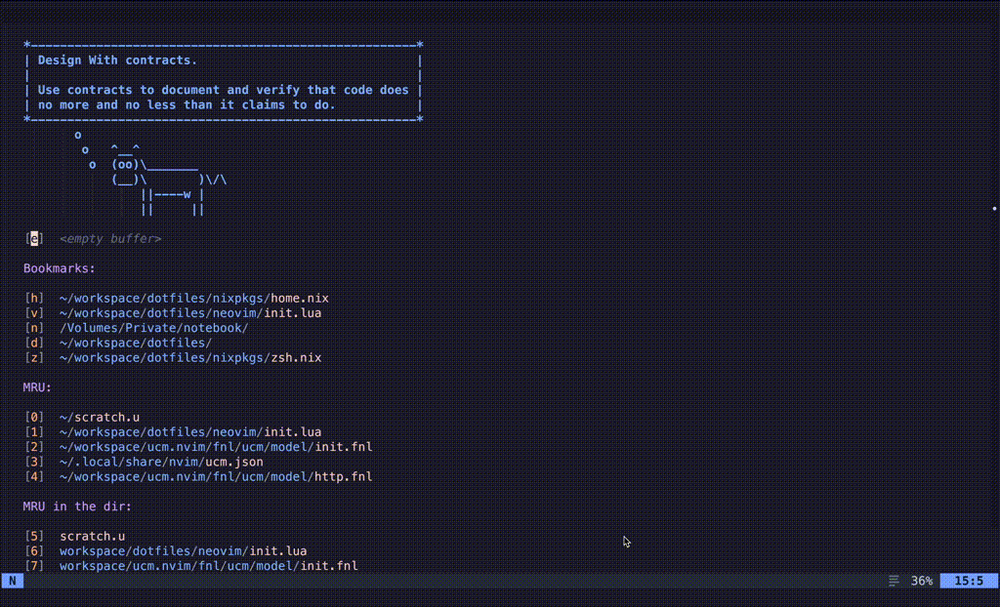

# ucm.nvim

_Unison at your fingertips_

A little Neovim helper for [Unison](https://www.unison-lang.org/) programming language.



## Setup

```lua
{
  'chuwy/ucm.nvim',
  dependencies = {
    'nvim-telescope/telescope.nvim',
    'rcarriga/nvim-notify'              -- A temporary requirement
  },
  config = function()
    require('ucm').setup {
      endpoint = 'http://127.0.0.1:6783/local_ucm/api/'
    }
  end
}
```

The only supported setting now is `endpoint`. You can omit it, but then `ucm.nvim` will be asking you for you API endpoint,
which you can get with `api` command inside `ucm`. Or you can just use a static one, like above with:

```bash
$ ucm --port 6783 --token local_ucm
```

This plugin works with ucm M5d and later.

## Usage

This plugin exposes three [Telescope](https://github.com/nvim-telescope/telescope.nvim) pickers:

- `:Telescope ucm projects` - this is the first picker you need to use, it allows you to specify a project and a branch. The will be saved for later, but bear in mind that your ucm might have a different opinion on a chosed project/branch pair
- `:Telescope ucm list` - here you can navigate Unison namespaces like it's a usual filesystem
- `:Telescope ucm find` - allows you to find terms and types by name as you type

Two latter pickers insert an entity to edit if you press Return.

## FAQ

### Why not LSP?

Doing most of the things the plugin does currently is _likely_ possible via LSP. But at the same time, ucm.nvim is planned to be much
more than just an "interactive symbol viewer" - I plan to add many features (such as adding terms and types, creating and switching projects etc) that are simply out of scope of LSP.

### ucm and ucm.nvim show me different projects

That's because running ucm instance does not provide info about project you're currently working on. Instead `Telescope ucm project` just picks a scope for search.
